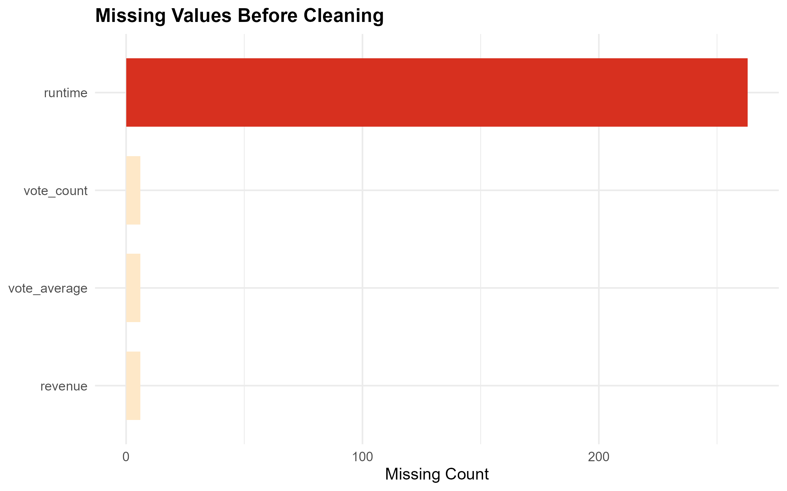
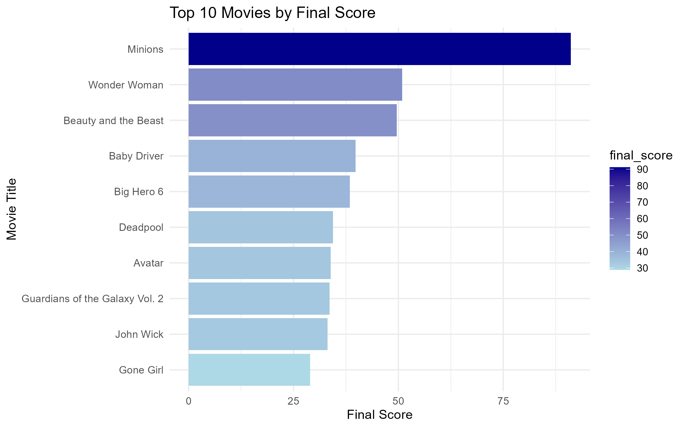
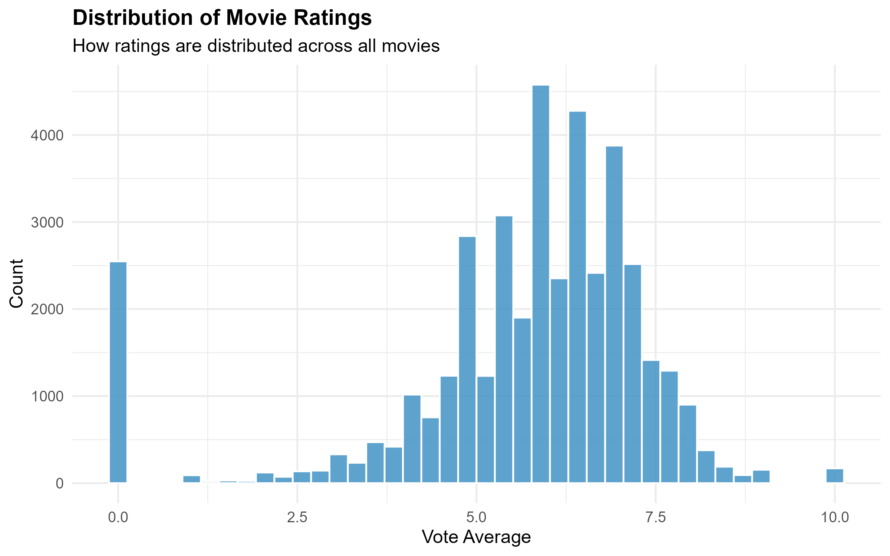
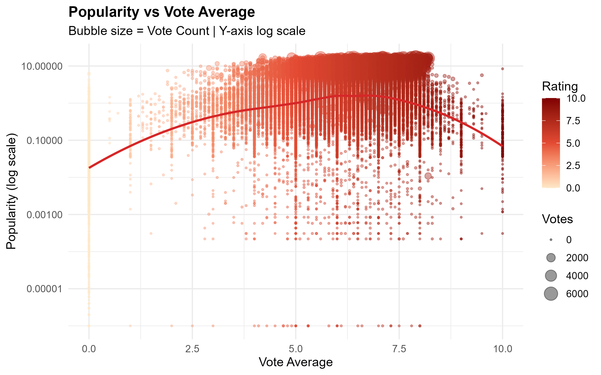
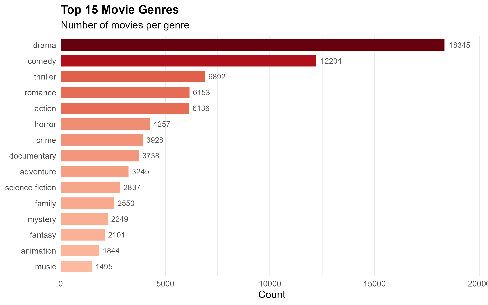
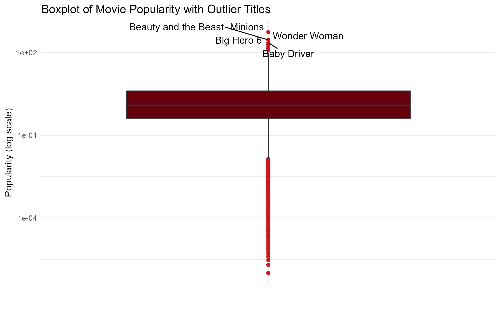
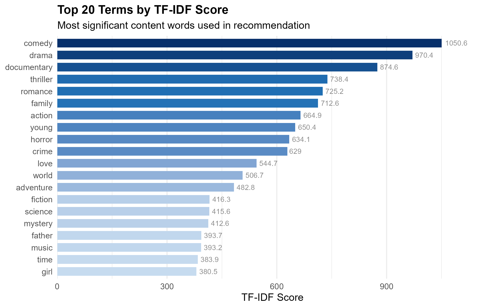

# Project Title- CineMatch: Movie Recommendation System

**Team:** Team 7

**GitHub Repository:** [movie_recommendation_system_Team7](https://github.com/idsaturn07/movie_recommendation_system_Team7)

---

## Submission Information

- All project files are available at: https://github.com/idsaturn07/movie_recommendation_system_Team7

---

## Team Members

| Name | Roll Number |
|---|---|
| Inchara M P | 2023BCS0129 |
| Jadi Hemarupini | 2023BCS0126 |
| Deepanjali Tudu | 2023BCS0066 |
| Praneetha Pillai | 2023BCS0207 |

---

## Problem Statement

With over 50,000 movies available across streaming platforms, users struggle to find content they will genuinely enjoy. Most existing recommendation systems rely solely on popularity, recommending the same mainstream titles repeatedly without considering individual preferences or content similarity. There is a clear need for a smarter, personalised recommendation system that goes beyond popularity and suggests movies based on what a user actually likes.

---

## Objectives

- Analyse a large-scale movie metadata dataset to extract meaningful patterns
- Build a content-based recommendation system using TF-IDF vectorisation
- Use cosine similarity and genre-based Jaccard similarity to suggest relevant movies
- Develop a hybrid scoring model combining content similarity, genre match, and popularity
- Deploy an interactive Shiny web application for real-time movie recommendations
- Evaluate model performance using Genre Precision@10 and cosine similarity metrics

---

## Dataset

**Source:** [The Movies Dataset — Kaggle](https://www.kaggle.com/datasets/rounakbanik/the-movies-dataset?select=movies_metadata.csv)

**File:** `movies_metadata.csv`

| Property | Value |
|---|---|
| Number of Observations | 45,466 |
| Number of Variables | 24 |
| File Size | ~34 MB |

**Key Attributes Used:**

| Column | Type | Description |
|---|---|---|
| title | String | Movie title |
| genres | String | Genre tags stored as Python dict string |
| overview | String | Plot summary of the movie |
| popularity | Float | TMDB popularity score |
| vote_average | Float | Average user rating (0–10) |
| vote_count | Integer | Total number of user votes |
| original_language | String | Original language of the movie |

> **Note:** This dataset is publicly available on Kaggle and is NOT included in this repository due to its large file size (~34 MB). See `data/dataset_description.md` for download instructions.

---

## Methodology

### Data Preprocessing
- Loaded raw `movies_metadata.csv` and inspected structure, dimensions, and missing values
- Removed rows with missing or empty title, genres, and overview fields
- Converted popularity, vote_average, and vote_count to numeric types
- Removed rows with invalid numeric values and duplicate titles (kept highest vote_count)
- Engineered new features: combined content field, z-score scaled numerical features, composite final score
- Saved cleaned dataset as `data/movies_final.csv`

### Exploratory Data Analysis
- Visualised missing value distribution before and after cleaning
- Plotted distribution of vote averages across all movies
- Analysed relationship between popularity and rating using scatter plots
- Extracted and visualised top 15 genres by frequency
- Identified popularity outliers using boxplots with IQR method
- Computed and visualised top 20 TF-IDF terms across the corpus

### Model Used — Hybrid Content-Based Recommender
The recommendation model combines three signals:

1. **TF-IDF + Cosine Similarity (55%):**
   - Built a TF-IDF matrix from a combined content field (genres × 4, keywords × 2, tagline, overview)
   - Applied text preprocessing: lowercasing, punctuation removal, stopword removal
   - Computed pairwise cosine similarity between all movie vectors

2. **Genre Jaccard Similarity (40%):**
   - Parsed genre tags from Python-style dictionary strings
   - Computed Jaccard similarity between genre sets of query and candidate movies
   - Ensures genre-relevant recommendations even when descriptions differ

3. **Popularity Score (5%):**
   - Normalised composite score from popularity, vote average, and vote count
   - Gives a mild quality boost to well-rated movies

**Final Score Formula:**
```
final_score = (0.55 × cosine_similarity) + (0.40 × genre_jaccard) + (0.05 × popularity_score)
```

### Evaluation Methods
- **Genre Precision@10:** For each query movie, checks what fraction of the top 10 recommendations share at least one genre — sampled across 200 random movies
- **Cosine Similarity Coverage:** Fraction of movie pairs with non-zero similarity
- **TF-IDF Density:** Sparsity of the term-document matrix
- **Average and Max Cosine Similarity:** Distribution of similarity scores

---

## Results

| Metric | Value |
|---|---|
| Total Movies | 3,000 |
| Vocabulary Size | 8,016 terms |
| TF-IDF Density | 0.29% |
| Average Cosine Similarity | 0.0202 |
| Max Cosine Similarity | 1.0 |
| Coverage | 32.3% |
| Sparsity | 67.7% |
| Precision @ 0.05 | 43.13% |
| **Genre Precision@10** | **90.8%** |
| Movies with Genres | 3,000 / 3,000 |

The model achieves **90.8% Genre Precision@10**, meaning 9 out of 10 recommendations share at least one genre with the queried movie. Low TF-IDF density and coverage are expected for sparse text data and do not impact recommendation quality, as the genre-based filtering compensates effectively.

---

## Key Visualizations

### Missing Values Before Cleaning


### Top 10 Movies by Final Score


### Distribution of Movie Ratings


### Popularity vs Vote Average


### Top 15 Movie Genres


### Popularity Boxplot with Outliers


### Top 20 TF-IDF Terms


### Cosine Similarity Distribution


---

## How to Run the Project

### Prerequisites
- R (version 4.0 or higher)
- RStudio (recommended)

### Steps

**1. Clone the repository:**
```bash
git clone https://github.com/idsaturn07/movie_recommendation_system_Team7.git
cd movie_recommendation_system_Team7
```

**2. Install required packages:**
```r
source("requirements.R")
```

**3. Download the dataset:**
- Go to https://www.kaggle.com/datasets/rounakbanik/the-movies-dataset
- Download `movies_metadata.csv`
- Place it inside the `data/` folder

**4. Run data preprocessing and EDA:**
- Open `scripts/01_data_preparation_and_eda.Rmd` in RStudio
- Run all chunks (`Ctrl + Alt + R`)
- This generates `data/movies_final.csv`

**5. Run model evaluation:**
```r
source("scripts/03_evaluation.R")
```

**6. Launch the Shiny app:**
```r
shiny::runApp('app')
```

### Folder Structure

```
movie_recommendation_system_Team7/
├── app/
│   ├── app.R                              # Shiny app server and UI
│   └── www/
│       └── app.js                         # Frontend JavaScript
├── data/
│   ├── movies_metadata.csv                # Raw dataset (not in GitHub)
│   ├── movies_final.csv                   # Cleaned dataset (not in GitHub)
│   └── dataset_description.md            # Dataset documentation
├── results/
│   ├── figures/                           # All generated plots
│   └── tables/
│       └── model_performance.csv          # Evaluation metrics
├── scripts/
│   ├── 01_data_preparation_and_eda.Rmd   # Preprocessing and EDA
│   ├── 02_modeling.R                      # Model building
│   └── 03_evaluation.R                    # Model evaluation
├── requirements.R                         # Package installer
└── README.md                              # Project documentation
```

---

## Conclusion

CineMatch successfully demonstrates a hybrid content-based movie recommendation system built entirely in R. By combining TF-IDF cosine similarity with genre-based Jaccard scoring and a popularity boost, the system achieves 90.8% Genre Precision@10 across 3,000 movies. The interactive Shiny application allows users to search for any movie, receive personalised recommendations, rate movies, and get further suggestions based on their ratings. The project shows that even without user history or collaborative filtering, content-based methods can deliver highly relevant and personalised recommendations.

---

## Contribution

| Roll Number | Name | Contribution |
|---|---|---|
| 2023BCS0126 | Jadi Hemarupini | Data cleaning, feature engineering — numerical scaling, composite score, dataset preparation |
| 2023BCS0207 | Praneetha Pillai | Exploratory data analysis, text preprocessing, corpus building, visualisations |
| 2023BCS0129 | Inchara M P | Model development — TF-IDF vectorisation, Cosine Similarity, Genre Jaccard Similarity, hybrid scoring |
| 2023BCS0066 | Deepanjali Tudu | Model evaluation — Genre Precision@10, cosine similarity metrics, evaluation pipeline |

---

## References

- Rounak Banik. *The Movies Dataset*. Kaggle, 2017. https://www.kaggle.com/datasets/rounakbanik/the-movies-dataset
- TMDB (The Movie Database) API. https://www.themoviedb.org/documentation/api
- Feinerer, I., Hornik, K., & Meyer, D. (2008). *Text Mining Infrastructure in R*. Journal of Statistical Software, 25(5).
- Chang, W. et al. *Shiny: Web Application Framework for R*. https://shiny.posit.co/
- Wickham, H. *ggplot2: Elegant Graphics for Data Analysis*. Springer, 2016.
- Leskovec, J., Rajaraman, A., & Ullman, J. D. *Mining of Massive Datasets* — Chapter 9: Recommendation Systems. http://www.mmds.org/
