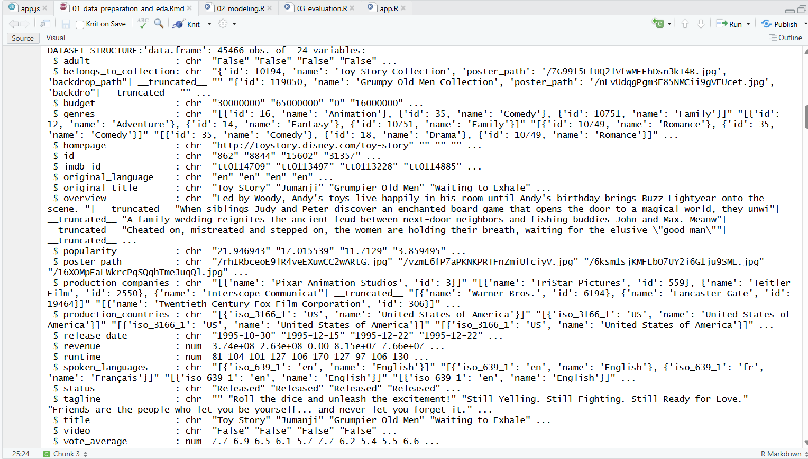

# Dataset Description

**Dataset Name:** The Movies Dataset  
**Source:** https://www.kaggle.com/datasets/rounakbanik/the-movies-dataset?select=movies_metadata.csv  
**File:** movies_metadata.csv  

**Description:**  
Contains metadata for 45,466 movies scraped from TMDB (The Movie Database).
Includes information such as plot overviews, genres, release dates, ratings,
popularity scores, and vote counts. Genres are stored as Python-style
dictionary strings requiring custom parsing.

**Number of instances:** 45,466  
**Number of attributes:** 24  

**Key Attributes Used in This Project:**

| Column | Type | Description |
|---|---|---|
| title | String | Movie title |
| genres | String | Genre tags stored as Python dict string |
| overview | String | Plot summary of the movie |
| popularity | Float | TMDB popularity score |
| vote_average | Float | Average user rating (0–10) |
| vote_count | Integer | Total number of user votes |
| original_language | String | Original language of the movie |

**How to Download:**  
1. Go to https://www.kaggle.com/datasets/rounakbanik/the-movies-dataset  
2. Click **Download** or select `movies_metadata.csv` from the files list  
3. Place the downloaded file inside the `data/` folder of this project

**After Downloading, Run:**  
Open `scripts/01_data_preparation_and_eda.Rmd` in RStudio and run all chunks (`Ctrl+Alt+R`).
This will clean the raw data and generate `data/movies_final.csv`
which is required to run the app and all other scripts.

**Note:** This dataset is publicly available on Kaggle and is NOT included
in this repository due to its large file size (~34 MB).

## Dataset Structure Screenshot

